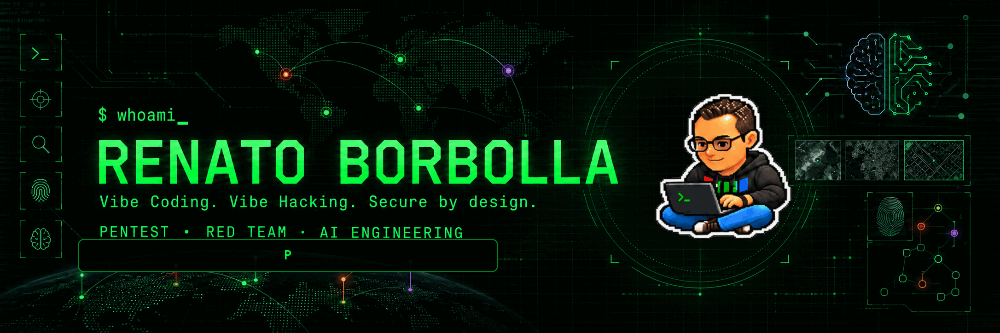
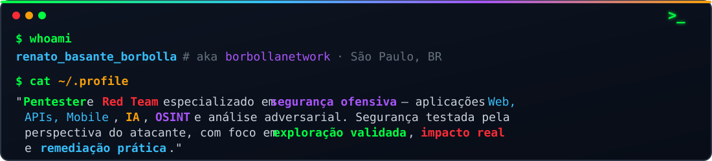

<!-- Perfil de Renato Basante Borbolla — tema espelhando renatoborbolla.com (dark, matrix green, JetBrains Mono) -->

---

### `//` Áreas de Atuação

| | |
|---|---|
| **Pentest** | Testes em aplicações web, redes e infraestrutura |
| **Red Team / Adversary Simulation** | Simulações adversariais e exercícios ofensivos avançados |
| **OSINT & Engenharia Social** | Mapeamento de superfície (assets, colaboradores, tecnologias) e phishing direcionado |
| **API Security** | Segurança de APIs e lógica de negócio |
| **Mobile Pentest** | Segurança de aplicações Android / iOS |
| **Cloud & Infraestrutura** | AWS e Azure, Azure AD, movimentação lateral híbrida |
| **Segurança de IA** | Análise adversarial de sistemas com IA/LLM |
| **Cyber Threat Intelligence** | Análise de ameaças e monitoramento de superfície de ataque |
| **Forense Digital** | Coleta, preservação e análise forense de dados |

---

### `>` Arsenal

 

---

### `>` Projetos em destaque

- **[HackerDummy](https://github.com/borbollanetwork/HackerDummy)** — benchmark para medir e treinar agentes de IA em pentest. Labs web e mobile deliberadamente vulneráveis, cada um com gabarito, para pontuar recall e precisão de qualquer agente.
- **[airset](https://github.com/borbollanetwork/airset)** — Router Social Engineering Toolkit (evil twin / captive portal WPA), modernizado para 2026 com painel de controle web.
- **[Crowdfinder](https://github.com/borbollanetwork/Crowdfinder)** — script PowerShell para encontrar máquinas no domínio sem CrowdStrike instalado.

### `>` Artigos

Escrevo sobre Pentest, Red Team, OSINT e simulação adversarial no **[Medium](https://renatoborbolla.medium.com)**.

---

 

---

### `>` Contato

`#Pentest` &nbsp;·&nbsp; `#RedTeam` &nbsp;·&nbsp; `#OSINT` &nbsp;·&nbsp; `#C2` &nbsp;·&nbsp; `#AWS` &nbsp;·&nbsp; `#Azure`

